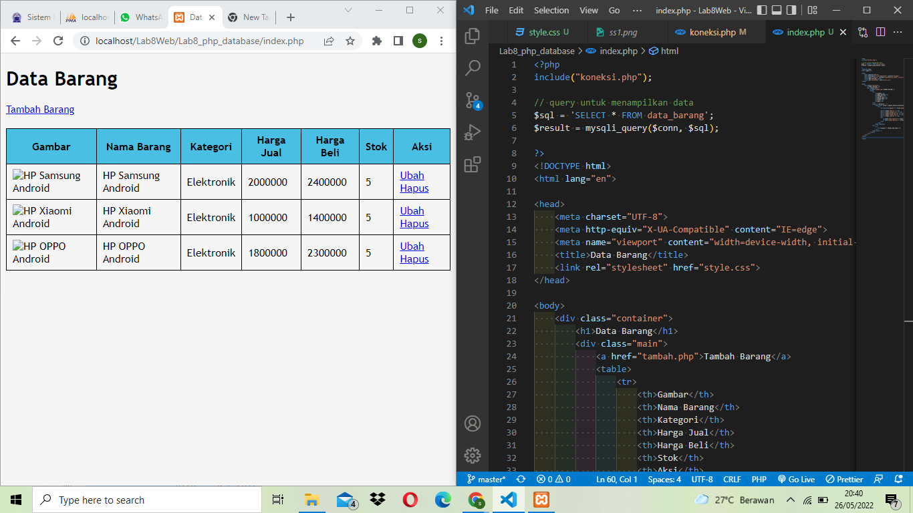
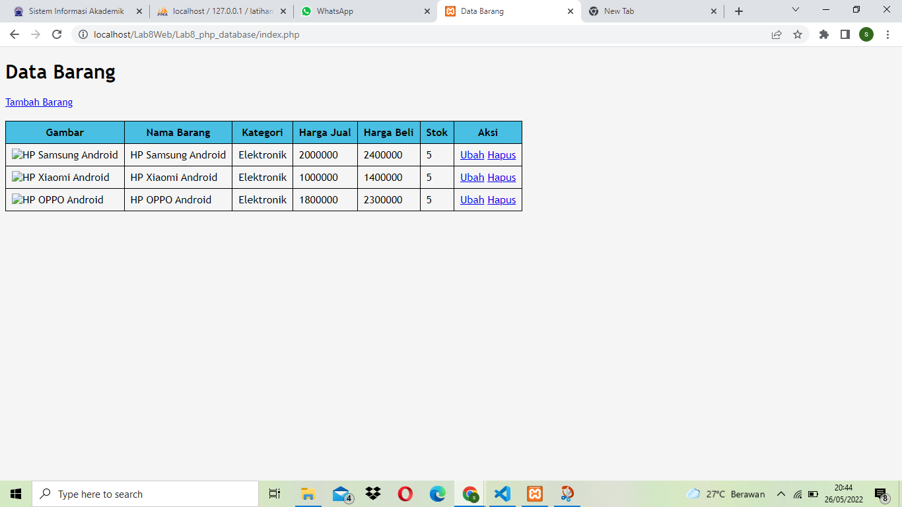
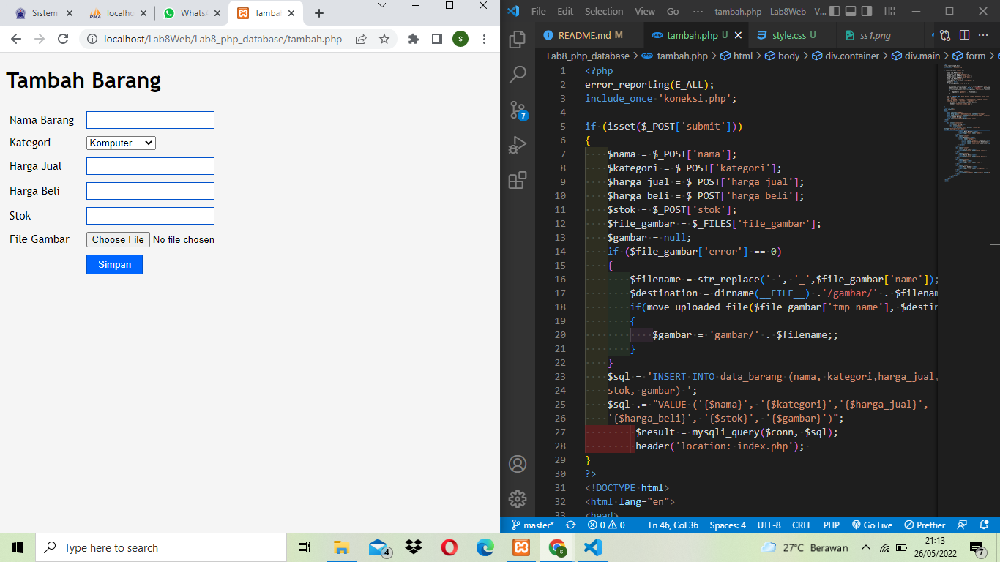
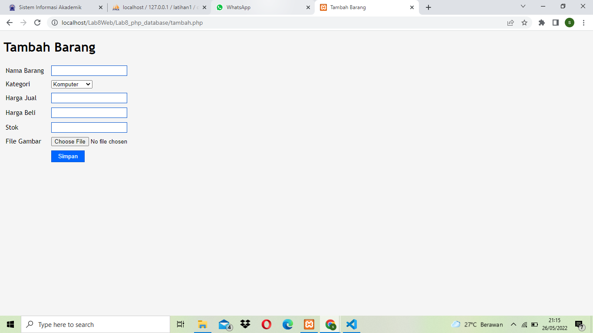
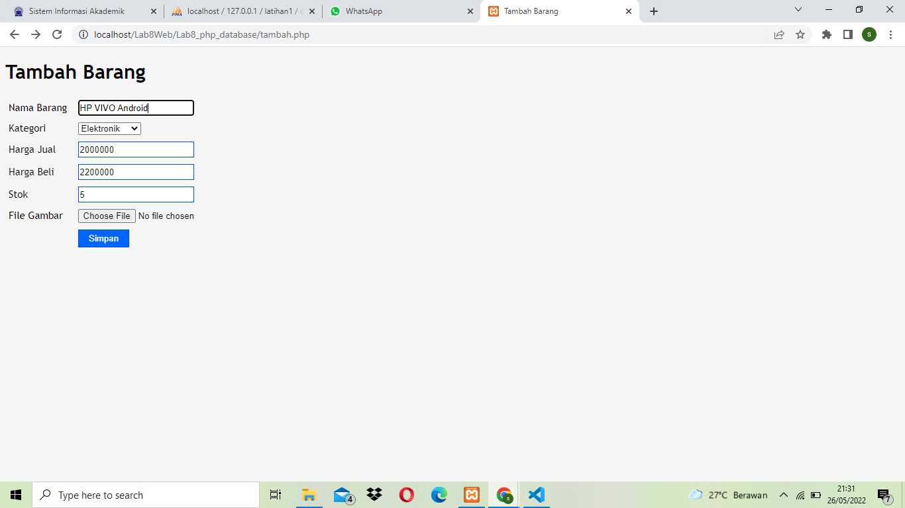
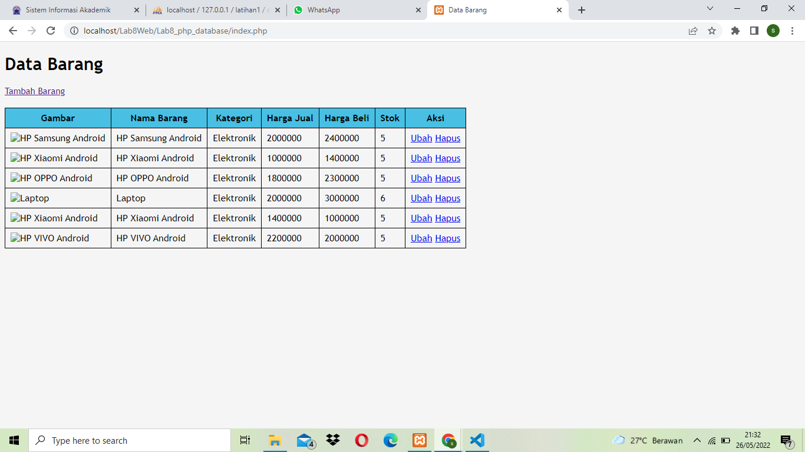

| Nama   | Sardin         |
| ------ | -------------- |
| NIM    | 312010135      |
| Kelas  | TI.20.A1       |
| Matkul | Pemograman Web |

## PERTEMUAN 10

## lAB 8 WEB

Dipertemuan kali ini kita akan mempelajari **PHP CRUD** dan bagaimana mengoneksi database dengan **php**.

## LANGKAH - LANGKAH PRAKTIKUM

### 1). MENJALANKAN MYSQL SERVER

<br>
**PENJELASAN**
Menjalankan **MySQL** Server dari **XAMPP CONTROL**

### 2). MEMBUAT DATABASE

```
CREATE DATABASE latihan1;
```

**Membuat Tabel**

```
CREATE TABLE data_barang (
id_barang int(10) auto_increment Primary Key,
kategori varchar(30),
nama varchar(30),
gambar varchar(100),
harga_beli decimal(10,0),
harga_jual decimal(10,0),
stok int(4)
);
```


### 3). MENAMBAHKAN DATA

<br>
Menambahkan Data pada **DATABASE**<br>

```
INSERT INTO data_barang (kategori, nama, gambar, harga_beli, harga_jual, stok)
VALUES ('Elektronik', 'HP Samsung Android', 'hp_samsung.jpg', 2000000, 2400000, 5),
('Elektronik', 'HP Xiaomi Android', 'hp_xiaomi.jpg', 1000000, 1400000, 5),
('Elektronik', 'HP OPPO Android', 'hp_oppo.jpg', 1800000, 2300000, 5);
```

<br>
Data berhasil ditambahkan<br>
<br>

```
select * from data_barang;
```

### 4). MEMBUAT PROGRAM CRUD

Buat folder **lab8_php_database** pada root directory web server<br>
<br>
Kemudian akses diectory tersebut dengan mengakses URL:http://localhost/Lab8Web/Lab8_php_database/<br>
<br>

### 5). MEMBUAT FILE KONEKSI DATABASE

Buat file baru dengan nama **koneksi.php**<br>
<br>
Database berhasil Terkoneksi

```code php
<?php
$host = "localhost";
$user = "root";
$pass = "";
$db = "latihan1";

$conn = mysqli_connect($host, $user, $pass, $db);
if ($conn == false)
{
    echo "Koneksi ke server gagal.";
    die();
} else echo "Koneksi berhasil";
?>
```

### 6). MEMBUAT FILE INDEX UNTUK MENAMPILKAN DATA (READ)
Buat file baru dengan nama **index.php**

**PENJELASAN**<br>
Tampilan dan hasil pada menu **index.php** atau program menampilkan data.

Tampilan full **index layout** untuk menampilkan data
```code php
<?php
include("koneksi.php");

// query untuk menampilkan data
$sql = 'SELECT * FROM data_barang';
$result = mysqli_query($conn, $sql);

?>
<!DOCTYPE html>
<html lang="en">
<head>
    <meta charset="UTF-8">
    <meta http-equiv="X-UA-Compatible" content="IE=edge">
    <meta name="viewport" content="width=device-width, initial-scale=1.0">
    <title>Data Barang</title>
    <link rel="stylesheet" href="style.css">
</head>
<body>
    <div class="container">
        <h1>Data Barang</h1>
        <div class="main">
            <a href="tambah.php">Tambah Barang</a>
            <table>
                <tr>
                    <th>Gambar</th>
                    <th>Nama Barang</th>
                    <th>Kategori</th>
                    <th>Harga Jual</th>
                    <th>Harga Beli</th>
                    <th>Stok</th>
                    <th>Aksi</th>
                </tr>
            <?php if($result): ?>
            <?php while($row = mysqli_fetch_array($result)): ?> 
                <tr>
                    <td>" alt="<?=
$row['nama'];?>"></td>
                    <td><?= $row['nama'];?></td>
                    <td><?= $row['kategori'];?></td>
                    <td><?= $row['harga_beli'];?></td>
                    <td><?= $row['harga_jual'];?></td>
                    <td><?= $row['stok'];?></td>
                    <td>
                    <a href="ubah.php?id=<?= $row['id_barang'];?>">Ubah</a>
                    <a href="hapus.php?id=<?= $row['id_barang'];?>">Hapus</a> 
                    </td>
                </tr>
                <?php endwhile; else: ?>
                 <tr>
                 <td colspan="7">Belum ada data</td>
                 </tr>
                 <?php endif; ?>  
             </table> 
        </div>
    </div>
</body>
</html>
```
**Menambahkan css**
```code css
body {
    background-color: whitesmoke;
    font-family: 'Trebuchet MS', 'Lucida Sans Unicode', 'Lucida Grande', 'Lucida Sans', Arial, sans-serif;
    font-size: 15px;
    color: black;
}
table{
    border-collapse: collapse;
    margin-top: 20px;
}
th{
    background-color: #48bfe3;
}
th, td{
    border: 1px solid black;
    font-size: 16px;
    padding: 7px 9px;
}
```
### 7). MENAMBAHKAN DATA(CREATE)
Buat file baru dengan nama **tambah.php**

**PENJELASAN**<br>
Program menambahkan data atau **Create**

```code php
<?php
error_reporting(E_ALL);
include_once 'koneksi.php';

if (isset($_POST['submit']))
{
    $nama = $_POST['nama'];
    $kategori = $_POST['kategori'];
    $harga_jual = $_POST['harga_jual'];
    $harga_beli = $_POST['harga_beli'];
    $stok = $_POST['stok'];
    $file_gambar = $_FILES['file_gambar'];
    $gambar = null;
    if ($file_gambar['error'] == 0)
    {
        $filename = str_replace(' ', '_',$file_gambar['name']);
        $destination = dirname(__FILE__) .'/gambar/' . $filename;
        if(move_uploaded_file($file_gambar['tmp_name'], $destination))
        {
            $gambar = 'gambar/' . $filename;;
        }
    }
    $sql = 'INSERT INTO data_barang (nama, kategori,harga_jual, harga_beli,
    stok, gambar) ';
    $sql .= "VALUE ('{$nama}', '{$kategori}','{$harga_jual}',
    '{$harga_beli}', '{$stok}', '{$gambar}')";
         $result = mysqli_query($conn, $sql);
         header('location: index.php'); 
}
?>
<!DOCTYPE html>
<html lang="en">
<head>
    <meta charset="UTF-8">
    <meta http-equiv="X-UA-Compatible" content="IE=edge">
    <meta name="viewport" content="width=device-width, initial-scale=1.0">
    <title>Tambah Barang</title>
    <link rel="stylesheet" href="style.css">
</head>
<body>
    <div class="container">
        <h1>Tambah Barang</h1>
        <div class="main">
            <form method="post" action="tambah.php"
enctype="multipart/form-data">
                <div class="input">
                    <label> Nama Barang</label>
                    <input type="text" name="nama"/>
                </div>
                <div class="input">
                    <label>Kategori</label>
                    <select name="kategori">
                        <option value="Komputer">Komputer</option>
                        <option value="Elektronik">Elektronik</option>
                        <option value="HandPhone">HandPhone</option>
                    </select>
                </div>
                <div class="input">
                    <label>Harga Jual</label>
                    <input type="text" name="harga_jual" />
                </div>
                <div class="input">
                    <label>Harga Beli</label>
                    <input type="text" name="harga_beli" />
                </div>
                <div class="input">
                    <label>Stok</label>
                    <input type="text" name="stok" />
                </div>
                <div class="input">
                    <label>File Gambar</label>
                    <input type="file" name="file_gambar" />
                </div>
                <div class="submit">
                    <input type="submit" name="submit" value="Simpan" />
                </div>
            </form>
        </div>
    </div>
</body>
</html>
```
### 8). MENGUBAH DATA (UPDATE)
Buat file baru dengan nama **ubah.php**

maka hasilnya yang akan keluar seperti dibawah

di atas adalah hasil dari program ubah atau **update**
```code php
<?php
error_reporting(E_ALL);
include_once 'koneksi.php';

if (isset($_POST['submit']))
{
    $id = $_POST['id'];
    $nama = $_POST['nama'];
    $kategori = $_POST['kategori'];
    $harga_jual = $_POST['harga_jual'];
    $harga_beli = $_POST['harga_beli'];
    $stok = $_POST['stok'];
    $file_gambar = $_FILES['file_gambar'];
    $gambar = null;

    if ($file_gambar['error'] == 0)
    {
        $filename = str_replace(' ', '_', $file_gambar['name']);
        $destination = dirname(__FILE__) . '/gambar/' . $filename;
        if (move_uploaded_file($file_gambar['tmp_name'], $destination))
        {
            $gambar = 'gambar/' . $filename;;
        }    
    }

    $sql = 'UPDATE data_barang SET ';
    $sql .= "nama = '{$nama}', kategori = '{$kategori}', ";
    $sql .= "harga_jual = '{$harga_jual}', harga_beli = '{$harga_beli}', stok
    = '{$stok}' ";
    if (!empty($gambar))
         $sql .= ", gambar = '{$gambar}' ";
    $sql .= "WHERE id_barang = '{$id}'";
    $result = mysqli_query($conn, $sql);   
    
    header('location: index.php');
}

//$id = $_GET['id']; --> Ini tidak akan mendapatkan hasil atau value
$id = (isset($_POST['id']) ? $_POST['id'] : ''); // karena ingin mendapatkan form dengan methot post.
$sql = "SELECT * FROM data_barang WHERE id_barang = '{$id}'";
$result = mysqli_query($conn, $sql);
if (!$result) die('Error: Data tidak tersedia');
$data = mysqli_fetch_array($result);

function is_select($var, $val) {
    if ($var == $val) return 'selected="selected"';
    return false;
}

?>
<!DOCTYPE html>
<html lang="en">
<head>
    <meta charset="UTF-8">
    <meta http-equiv="X-UA-Compatible" content="IE=edge">
    <meta name="viewport" content="width=device-width, initial-scale=1.0">
    <title>Ubah Barang</title>
    <link rel="stylesheet" href="style.css">
</head>
<body>
    <div class="container">
        <h1>Ubah Barang</h1>
        <div class="main">
        <form method="post" action="ubah.php"
         enctype="multipart/form-data">
         <div class="input">
             <label>Nama Barang</label>
             <input type="text" name="nama" value="<?php echo
            $data['nama'];?>" />
         </div>
         <div class="input">
             <label>Kategori</label>
             <select name="kategori">
                <option <?php echo is_select
                ('Komputer', $data['kategori']);?> value="Komputer">Komputer</option>
                <option <?php echo is_select
                ('Komputer', $data['kategori']);?> value="Elektronik">Elektronik</option>
                <option <?php echo is_select
                ('Komputer', $data['kategori']);?> value="Hand Phone">Hand Phone</option>
             </select>
         </div>
         <div class="input">
             <label>Harga Jual</label>
             <input type="text" name="harga_jual" value="<?php echo
              $data['harga_jual'];?>" />
         </div>
         <div class="input">
             <label>Harga Beli</label>
             <input type="text" name="harga_beli" value="<?php echo
              $data['harga_beli'];?>" />
         </div>
         <div class="input">
             <label>Stok</label>
             <input type="text" name="stok" value="<?php echo
             $data['stok'];?>" />
         </div>
         <div class="input">
             <label>File Gambar</label>
             <input type="file" name="file_gambar" />
         </div>
         <div class="submit">
           <input type="hidden" name="id" value="<?php echo
           $data['id_barang'];?>" />
           <input type="submit" name="submit" value="Simpan" />
         </div>
     </form> 
     </div>
    </div>
</body>
</html>
```
### 9). MENGHAPUS DATA (DELETE)
Buat file baru dengan nama **hapus.php**<br>
**PENJELASAN**<br>
Jika ingin menghapus atau delete klik saja hapus maka akan terhapus secara otomatis oleh program,dan jika ingin kembali menambahkan klik Tambah Barang kemudian masukan inputan nya.
```code php
<?php
include_once 'koneksi.php';
$id = $_GET['id'];
$sql = "DELETE FROM data_barang WHERE id_barang = '{$id}'";
$result = mysqli_query($conn, $sql);
header('location: index.php');
?>
```