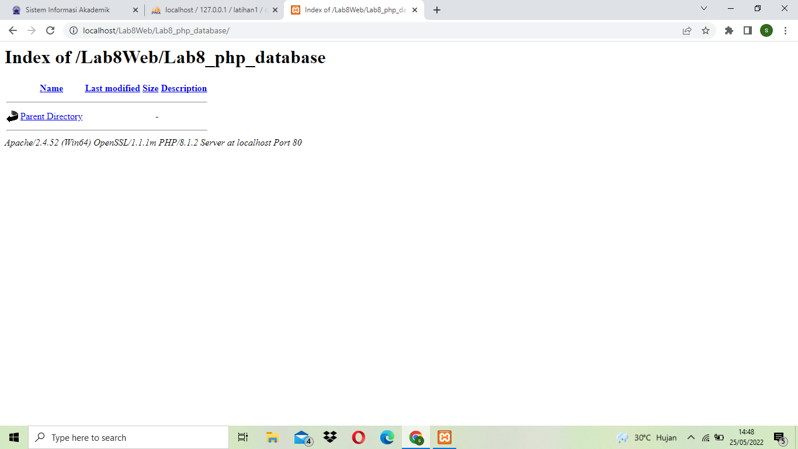

| Nama   | Sardin         |
| ------ | -------------- |
| NIM    | 312010135      |
| Kelas  | TI.20.A1       |
| Matkul | Pemograman Web |

## PERTEMUAN 10

## lAB 8 WEB

Dipertemuan kali ini kita akan mempelajari **PHP CRUD** dan bagaimana mengoneksi database dengan **php**.

## LANGKAH - LANGKAH PRAKTIKUM

### 1). MENJALANKAN MYSQL SERVER

<br>
**PENJELASAN**
Menjalankan **MySQL** Server dari **XAMPP CONTROL**

### 2). MEMBUAT DATABASE

```
CREATE DATABASE latihan1;
```

**Membuat Tabel**

```
CREATE TABLE data_barang (
id_barang int(10) auto_increment Primary Key,
kategori varchar(30),
nama varchar(30),
gambar varchar(100),
harga_beli decimal(10,0),
harga_jual decimal(10,0),
stok int(4)
);
```


### 3). MENAMBAHKAN DATA

<br>
Menambahkan Data pada **DATABASE**<br>

```
INSERT INTO data_barang (kategori, nama, gambar, harga_beli, harga_jual, stok)
VALUES ('Elektronik', 'HP Samsung Android', 'hp_samsung.jpg', 2000000, 2400000, 5),
('Elektronik', 'HP Xiaomi Android', 'hp_xiaomi.jpg', 1000000, 1400000, 5),
('Elektronik', 'HP OPPO Android', 'hp_oppo.jpg', 1800000, 2300000, 5);
```

<br>
Data berhasil ditambahkan<br>
<br>

```
select * from data_barang;
```

### 4). MEMBUAT PROGRAM CRUD

Buat folder **lab8_php_database** pada root directory web server<br>
<br>
Kemudian akses diectory tersebut dengan mengakses URL:http://localhost/Lab8Web/Lab8_php_database/<br>
<br>

### 5). MEMBUAT FILE KONEKSI DATABASE

Buat file baru dengan nama **koneksi.php**<br>
<br>
Database berhasil Terkoneksi

```code php
<?php
$host = "localhost";
$user = "root";
$pass = "";
$db = "latihan1";

$conn = mysqli_connect($host, $user, $pass, $db);
if ($conn == false)
{
    echo "Koneksi ke server gagal.";
    die();
} else echo "Koneksi berhasil";
?>
```

### 6). MEMBUAT FILE INDEX UNTUK MENAMPILKAN DATA (READ)
